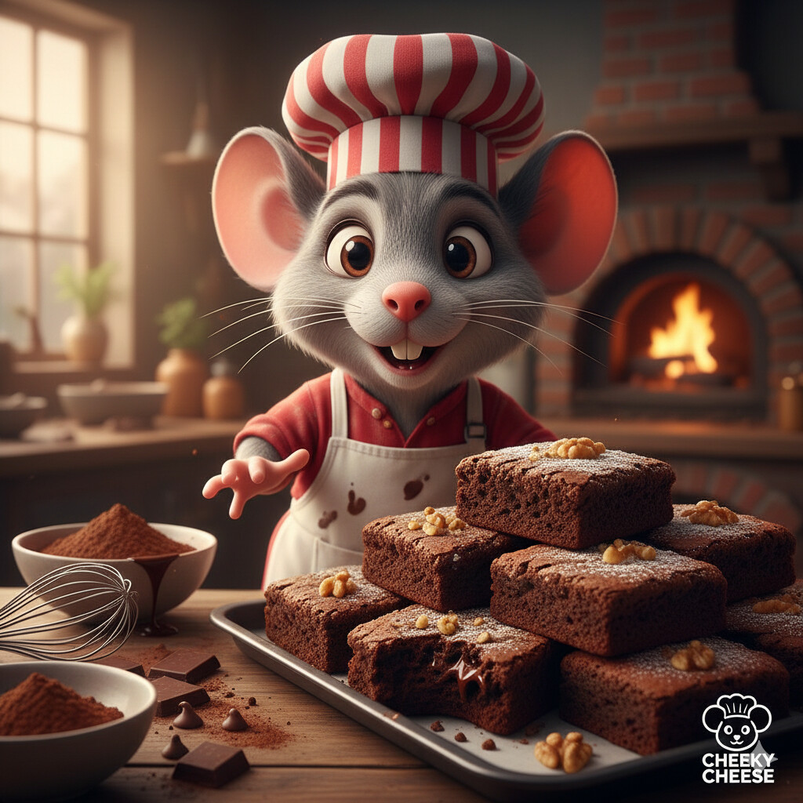
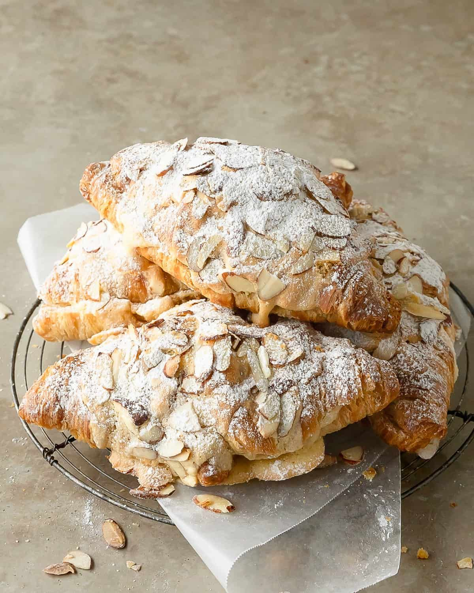

<html lang="id">
  <head>
    <meta charset="UTF-8" />
    <meta name="viewport" content="width=device-width, initial-scale=1.0" />
    <title>Doughlicious</title>
    <link rel="stylesheet" href="style.css" />
  </head>
  <body>
    <header>
      <h1>Doughlicious</h1>
      

        <button onclick="setLang('id')">Indonesia</button>
        <button onclick="setLang('en')">English</button>
        <button onclick="setLang('it')">Italiano</button>
      

    </header>

    <section class="hero">
      <h2 id="subtitle">Pastry Segar Setiap Hari</h2>
    </section>

    <section class="content">
      <h2 id="productTitle">Produk Favorit</h2>

      

        

          
          <h3>Cheeky Cheese</h3>
          
Creamy dan Lembut

          <button id="b1" onclick="order()">Pesan</button>
        

        

          
          <h3>Oopsie Brownie</h3>
          
Manis dan Chewy

          <button id="b2" onclick="order()">Pesan</button>
        

        

          
          <h3>Flake It Easy</h3>
          
Renyah dan Gurih

          <button id="b3" onclick="order()">Pesan</button>
        

        

          
          <h3>Puff Pop</h3>
          
Manis dan Creamy

          <button id="b4" onclick="order()">Pesan</button>
        

        

          
          <h3>Bun Bun</h3>
          
Manis dan Lembut

          <button id="b5" onclick="order()">Pesan</button>
        

        

          
          <h3>Berry Bubbly</h3>
          
Segar dan Renyah

          <button id="b6" onclick="order()">Pesan</button>
        

      

    </section>

    <footer>
      
📍 Bakery Kami • ☎ 0812-1962-4487

    </footer>

    
  </body>
</html>

let currentLang = "id";

const langData = {
  id: {
    subtitle: "Pastry Segar Setiap Hari",
    productTitle: "Produk Favorit",
    d1: "Creamy dan Lembut",
    d2: "Manis dan Chewy",
    d3: "Renyah dan Gurih",
    d4: "Manis dan Creamy",
    d5: "Manis dan Lembut",
    d6: "Segar dan Renyah",
    order: "Pesan",
    message: "Halo, saya ingin memesan produk dari Doughlicious",
    footer: "📍 Bakery Kami • ☎ 0812-1962-4487",
  },
  en: {
    subtitle: "Fresh Pastry Every Day",
    productTitle: "Featured Products",
    d1: "Creamy and Soft",
    d2: "Sweet and Chewy",
    d3: "Crispy and Tasty",
    d4: "Sweet and Creamy",
    d5: "Sweet and Soft",
    d6: "Fresh and Crunchy",
    order: "Order",
    message: "Hello, I would like to order from Doughlicious",
    footer: "📍 Our Bakery • ☎ 0812-1962-4487",
  },
  it: {
    subtitle: "Pasticceria Fresca Ogni Giorno",
    productTitle: "Prodotti Preferiti",
    d1: "Cremoso e Morbido",
    d2: "Dolce e Gommoso",
    d3: "Croccante e Gustoso",
    d4: "Dolce e Cremoso",
    d5: "Dolce e Morbido",
    d6: "Fresco e Croccante",
    order: "Ordina",
    message: "Ciao, vorrei ordinare dalla Doughlicious",
    footer: "📍 La Nostra Pasticceria • ☎ 0812-1962-4487",
  },
};

function setLang(lang) {
  currentLang = lang;
  document.getElementById("subtitle").innerText = langData[lang].subtitle;
  document.getElementById("productTitle").innerText =
    langData[lang].productTitle;
  document.getElementById("d1").innerText = langData[lang].d1;
  document.getElementById("d2").innerText = langData[lang].d2;
  document.getElementById("d3").innerText = langData[lang].d3;
  document.getElementById("d4").innerText = langData[lang].d4;
  document.getElementById("d5").innerText = langData[lang].d5;
  document.getElementById("d6").innerText = langData[lang].d6;
  document.getElementById("b1").innerText = langData[lang].order;
  document.getElementById("b2").innerText = langData[lang].order;
  document.getElementById("b3").innerText = langData[lang].order;
  document.getElementById("b4").innerText = langData[lang].order;
  document.getElementById("b5").innerText = langData[lang].order;
  document.getElementById("b6").innerText = langData[lang].order;
  document.getElementById("footer").innerText = langData[lang].footer;
}

function order() {
  const phone = "6281219624487";
  const text = encodeURIComponent(langData[currentLang].message);
  window.open(`https://wa.me/${phone}?text=${text}`, "_blank");
}

body {
  margin: 0;
  font-family: "Segoe UI", sans-serif;
  background-color: #fff6f0;
  color: #4a2c2a;
}

header {
  background-color: #f2b8a2;
  padding: 20px;
  text-align: center;
}

.language button {
  margin: 5px;
  padding: 6px 12px;
  border: none;
  border-radius: 6px;
  cursor: pointer;
  font-weight: bold;
}

.hero {
  background-image: url("https://images.unsplash.com/photo-1509440159596-0249088772ff");
  background-size: cover;
  background-position: center;
  height: 300px;
  display: flex;
  justify-content: center;
  align-items: center;
  color: white;
}

.hero h2 {
  background: rgba(0, 0, 0, 0.4);
  padding: 10px 20px;
  border-radius: 12px;
}

.content {
  padding: 40px;
}

.products {
  display: grid;
  grid-template-columns: repeat(auto-fit, minmax(250px, 1fr));
  gap: 20px;
}

.card {
  background: white;
  padding: 15px;
  border-radius: 15px;
  text-align: center;
  box-shadow: 0 4px 10px rgba(0, 0, 0, 0.15);
}

.card img {
  width: 100%;
  height: 180px;
  object-fit: cover;
  border-radius: 12px;
}

.card button {
  margin-top: 10px;
  padding: 10px;
  width: 100%;
  border: none;
  border-radius: 8px;
  background-color: #f2b8a2;
  cursor: pointer;
}

footer {
  background-color: #f2b8a2;
  text-align: center;
  padding: 15px;
  margin-top: 40px;
}
